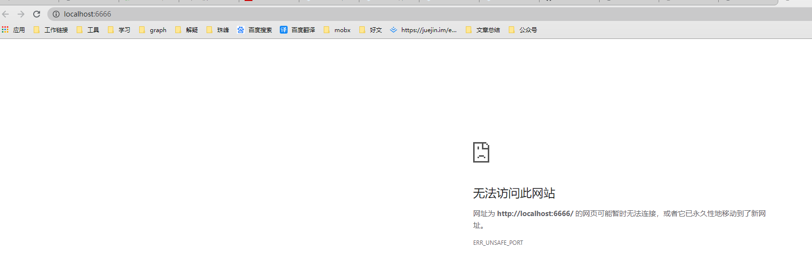

## package.json 中 script 命令

- webpack --config webpack.config.js
  - 如果 webpack.config.js 存在，则 webpack 命令将默认选择使用它。我们在这里使用 --config 选项只是向你表明，可以传递任何名称的配置文件。这对于需要拆分成多个文件的复杂配置是非常有用。

## 多个 chunk 相互如何引用

```
 webpack 配置
 entry: {
        app: './src/index.js',
        print: './src/print.js'
    },
    mode: 'development',
    output: {
        filename: '[name].bundle.js',
        path: path.resolve(__dirname, 'dist')
    },
```

```
js代码
import printMe from './print'

function component() {
    let element = document.createElement('div')
    let button = document.createElement('button')
    button.innerHTML = '点我'
    button.onclick = printMe;
    element.appendChild(button)
    return element
}
document.body.appendChild(component())
```

```
webpack 打包之后
var _print__WEBPACK_IMPORTED_MODULE_1__ = __webpack_require__(/*! ./print */ \"./src/print.js\");

button.onclick = _print__WEBPACK_IMPORTED_MODULE_1__[\"default\"];
```

首先声明一个变量，指向文件，使用引用的地方，直接使用当前定义的变量代替

## 使用 source map 可以解决，多个文件打包到一个文件后，无法精确找到报错文件的问题

- devtool 的不同值

## webpack 怎么区 development 还是 production

- process.env.NODE_ENV 的值可以在 webpack 配置文件和代码中获取
- webpack -p 或者 cross-env NODE_ENV=production 可以在 webpack 中的 process.env.NODE_ENV 的值
- 代码中 process.env.NODE_ENV 的值默认为 production，可以在配置文件中指定 mode:development，<font color=#0099ff>或者说，代码中的 process.env.NODE_ENV 只和 mode 有关（我的理解）</font>
- 记住，只设置 NODE_ENV，则不会自动设置 mode
- mode 如果不设置，webpack 会默认按照 mode: production 处理，production 会将 process.env.NODE_ENV 的值设为 production，

## HMR 如何工作

- runtime 支持两个方法 *check*和*apply*
- check 方法发送 http 请求 manifest。请求失败，说明没有更新。请求成功，待更新 chunk 会和当前加载过的 chunk 进行比较，对每个加载过的 chunk，会下载相对应的待更新 chunk，待所有待更新 chunk 完成下载，就会准备切换到 ready 状态
- apply 方法将所有待更新 chunk 标记为无效。对于每个无效模块，都需要在模块中有一个更新处理函数（updater handler），或者在它的父级模块们中有更新处理函数。否则，无效标记冒泡，并也使父级无效。每个冒泡继续，直到到达应用程序入口起点，或者到达带有更新处理函数的模块（以最先到达为准，冒泡停止）。如果它从入口起点开始冒泡，则此过程失败。
- 之后，所有无效模块都被（通过 dispose 处理函数）处理和解除加载，然后更新当前 hash,并且调用所有 accept 处理函数，runtime 切换回闲置状态，一切照常继续

## webpack 一些小坑

- webpack --watch
  - 如果在 html-webpack-plugin 里面指定了 template, 那 webpack --watch 只会在第一次执行的时候，会将 index.html 打包到 dist 文件里，而且在使用了 clean-webpack-plugin 的同事，修改文件重新打包之后，dist 文件中的 index.html 文件会被删除
- webpack-dev-server --port=6666 --open

  - 由于 6666-6669 这几个端口存在安全问题，禁止访问这几个端口，网页上显示 
  - 相关链接 https://www.cnblogs.com/solaZhan/p/8761287.html

- 'webpack' 不是内部或外部命令，也不是可运行的程序或批处理文件。

  - 
  - 此时重新单独安装一下 webpage 和 webpack-cli cnpm install webpack webpack-dev-server webpack-cli --save-dev

- Unexpected token: name «element», expected: punc «;» [app.bundle.js:109,8]

  - https://chen-cong.blog.csdn.net/article/details/103254670

- 使用 content hash 时，内容不变的情况下，content hash 是否一定不变

  - 通过使用 bundle 计算出内容散列(content hash)作为文件名称，这样在内容或文件修改时，浏览器中将通过新的内容散列指向新的文件，从而使缓存无效。一旦你开始这样做，你会立即注意到一些有趣的行为。即使表面上某些内容没有修改，计算出的哈希还是会改变。这是因为，runtime 和 manifest 的注入在每次构建都会发生变化

- mode 为 production 和 development 下，id 的值

```
    output: {
        path: path.join(__dirname, "dist"),
        filename: "[name].[id].[chunkhash].js"
    },
```

production 下 id 为索引，development 下，id 和 name 一样

## webpack4 使用 html-withimg-loader 遇到问题

- 问题：图片路径会有 default
  ```
  ERROR in Error: Parse Error:  <script type="text/javascript" src="bundle.js?588181ceb9662c845b90"></script></body> </html>
  ```
- 解决方案：file-loader 升级以后，esModule 参数默认为 true，改为 false 即可

```
  {
    test: /\.(png|jpg|gif)$/,
    use: [
        {
            loader: 'file-loader',
            options: {
                esModule: false,
                outputPath: 'assets'
            },
        },
    ],
  }
```

## 分离资源时，连续打包出现 Error: EPERM: operation not permitted, lstat 'D:\lee\webpack-practive\dist\css\main.css'(个例)

- 解决方法 在CleanWebpackPlugin中传入参数
不太准确，配置这个参数后，不会将文件全部清除干净

```
new CleanWebpackPlugin({
          dry: true,
      }),
```

## mode为production时，css资源不打包
 - https://blog.csdn.net/qq_37800886/article/details/87856352

## TODOS

- 第三方模块的按需加载
- SplitChunksPlugin
- devServer.proxy
